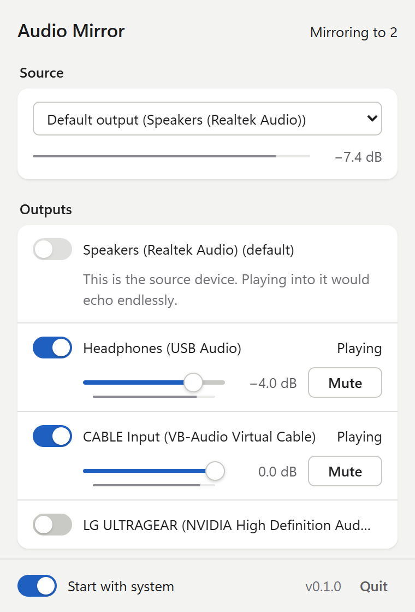
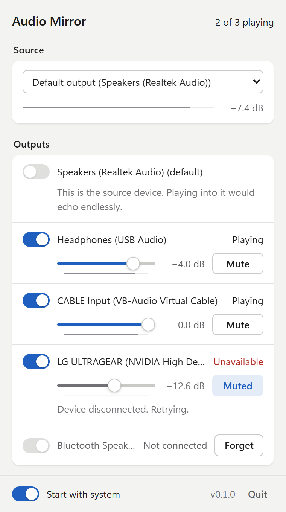

<h1 align="center">Audio Mirror</h1>

<p align="center">
  Play one sound source on as many speakers, headphones and virtual cables as you like, each with its own volume.
</p>

<p align="center">
  <a href="https://github.com/Alegzandr/audio-mirror/releases/latest"></a>
  
  <a href="LICENSE"></a>
</p>

<p align="center">
  <picture>
    <source media="(prefers-color-scheme: dark)" srcset="docs/images/panel-dark.png">
    
  </picture>
</p>

You are streaming or recording. You want to hear your computer in your headphones, and you also need the same sound in a virtual cable, a capture card or a second PC. Windows, macOS and Linux only play sound on one device at a time. Audio Mirror fixes that.

It sits in your tray. Pick a source, switch on the outputs that should play it, set each volume, and forget about it. It uses the same audio engine as OBS Studio's audio monitoring, the one streamers already trust on stage, without opening OBS and for several outputs at once.

## Contents

- [What you get](#what-you-get)
- [Download](#download)
- [Getting started](#getting-started)
- [Using the panel](#using-the-panel)
- [Common setups](#common-setups)
- [Troubleshooting](#troubleshooting)
- [Settings and uninstalling](#settings-and-uninstalling)
- [How it works](#how-it-works)
- [Development](#development)

## What you get

- **One source, any number of outputs.** Mirror your default output, a specific output device, or a microphone.
- **A volume and a mute per output.** The slider follows OBS's volume curve, so it feels the same as the mixer you already know.
- **No echo, ever.** The device being captured cannot be picked as a destination, so the sound can never loop back into itself.
- **Reconnects on its own.** Unplug your headset, plug it back in: the output resumes within a few seconds. Change your default output: the mirror follows.
- **Lives in the tray.** No window to keep open. Closing the panel only hides it.
- **Installs and updates itself.** One file per system. On Windows, running it is the whole install. Each launch checks for a new version first and applies it, like Discord.
- **Remembers everything.** Source, outputs, volumes and mutes are saved as you change them.

## Download

Get the file for your system from the [latest release](https://github.com/Alegzandr/audio-mirror/releases/latest).

| System | File |
| --- | --- |
| Windows 10 and 11 (x64) | `Audio-Mirror_<version>_windows_x64_setup.exe` |
| macOS 13 or later (Apple Silicon and Intel) | `Audio-Mirror_<version>_macos_universal.zip` |
| Linux (x86_64) | `Audio-Mirror_<version>_linux_x86_64.AppImage` |

<details>
<summary><strong>Windows</strong></summary>

1. Run the `.exe`. There is no installer window: Audio Mirror copies itself to `%LOCALAPPDATA%\AudioMirror`, adds itself to the Start menu and starts. The downloaded file can be deleted afterwards.
2. The app is not code-signed yet, so SmartScreen may show "Windows protected your PC". Click **More info**, then **Run anyway**.
3. Audio Mirror needs the WebView2 runtime. It ships with Windows 11 and with recent Windows 10 updates; if the app does not open, install it from [Microsoft](https://developer.microsoft.com/microsoft-edge/webview2/).

The icon appears in the notification area. If you do not see it, click the arrow next to the clock, and drag the icon onto the taskbar to keep it visible.

To uninstall, open **Settings > Apps > Installed apps**, find Audio Mirror and choose **Uninstall**. Your settings are kept in `%APPDATA%\io.github.alegzandr.audiomirror`.

</details>

<details>
<summary><strong>macOS</strong></summary>

1. Unzip the file and move **Audio Mirror.app** to your Applications folder.
2. The app is not notarized yet. Before the first launch, open Terminal and run:
   ```sh
   xattr -cr "/Applications/Audio Mirror.app"
   ```
3. Open the app. Its icon appears in the menu bar (there is no Dock icon).
4. To mirror your computer's sound, macOS asks for the **Screen Recording** permission, exactly like OBS does. Allow it in **System Settings > Privacy & Security > Screen Recording**, then choose **Restart audio** from the menu bar icon.

Microphones and other inputs only need the regular **Microphone** permission.

</details>

<details>
<summary><strong>Linux</strong></summary>

1. Make the AppImage executable and run it:
   ```sh
   chmod +x Audio-Mirror_*_linux_x86_64.AppImage
   ./Audio-Mirror_*_linux_x86_64.AppImage
   ```
2. Your desktop needs a system tray (on GNOME, install the AppIndicator extension).
3. Sound goes through PulseAudio or PipeWire (with `pipewire-pulse`, the default on most current distributions).

Most Linux trays do not report clicks on the icon itself: open the panel with **Open Audio Mirror** in the icon's menu.

</details>

## Getting started

1. **Open the panel.** Left click the tray icon (on Linux, use **Open Audio Mirror** in its menu).
2. **Pick a source.** Leave it on **Default output** to mirror everything your computer plays. The meter under the list moves when sound is coming in.
3. **Switch on your outputs.** Every output device is listed. Turn on the ones that should play the source; mirroring starts as soon as one is on.
4. **Set the volumes.** Drag each slider, or click **Mute** to silence one output without touching the others.
5. **Optional:** switch on **Start with system** at the bottom of the panel so the mirror is ready every time you log in.

That's it. Click anywhere else or press <kbd>Esc</kbd> to hide the panel; the sound keeps flowing.

## Using the panel

### Source

The source is what gets mirrored. The list offers:

- **Default output**: whatever your computer is playing. If you switch your default output in the system settings, Audio Mirror follows.
- **Output devices**: the sound of one specific output, even if it is not the default.
- **Input devices**: a microphone, an interface input, or a capture card.

The meter and the dB reading under the list show the level coming in. If the source device goes away, a message appears and Audio Mirror keeps trying to reopen it.

### Outputs

Each output has a switch, a volume slider with its own level meter, and a **Mute** button. The top right corner of the panel sums everything up: **Off** when no output is on, **Mirroring to 2** when everything plays, **1 of 2 playing** when an output has a problem.

On the right of each output, a word tells you what it is doing:

| Label | Meaning |
| --- | --- |
| Playing | Sound is going out. |
| Muted | Running, but silenced by the **Mute** button. |
| Starting | The device is being opened. |
| Waiting for source | The output is ready, the source is not. |
| Unavailable | The device could not be opened. The reason is shown underneath and Audio Mirror tries again every 3 seconds. |
| Skipped | This output is the device being captured. Playing into it would echo endlessly, so it is left out. |
| Not connected | A device you had switched on is unplugged. It comes back by itself when you plug it in, or click **Forget** to remove it from the list. |

<p align="center">
  <picture>
    <source media="(prefers-color-scheme: dark)" srcset="docs/images/output-states-dark.png">
    
  </picture>
</p>

### Tray menu

Right click the tray icon for:

- **Open Audio Mirror**: shows the panel.
- **Restart audio**: closes and reopens every device. Handy after changing drivers or granting a permission.
- **Quit**: stops mirroring and exits. The **Quit** button in the panel does the same.

### Updates

Each time Audio Mirror starts, including at login, a small window checks for a new version before anything else. If there is one, it is downloaded, its signature verified, installed, and the app restarts into it; otherwise (or without network) the app starts right away.

While the app runs, it checks again every few hours. A version found then is installed in the background, and a **Restart to update** button replaces the version number at the bottom of the panel. Nothing changes until you click it or the app next starts.

## Common setups

**Hear your stream in headphones and send it to OBS on the same PC.** Source: **Default output**. Outputs: your headphones and a virtual cable (for example [VB-Audio Virtual Cable](https://vb-audio.com/Cable/) on Windows or [BlackHole](https://github.com/ExistentialAudio/BlackHole) on macOS). In OBS, capture the cable. Lower the headphones without changing what the stream gets.

**Two-PC streaming.** Source: **Default output** on the gaming PC. Outputs: your headphones and the audio interface or capture card going to the streaming PC. Each side gets its own level.

**Share one microphone with two devices.** Source: your microphone, under **Input devices**. Outputs: the devices that need it, for example a virtual cable for a call and a recorder.

**Play the same sound in two rooms.** Source: **Default output**. Outputs: the speakers in each room, balanced with the sliders.

## Troubleshooting

**The meter under the source does not move.**
Make sure something is playing on the device you picked. On macOS, check that Audio Mirror is allowed under **Screen Recording** (for the default output) or **Microphone** (for inputs), then use **Restart audio**.

**An output says "Unavailable".**
Read the reason under it. The device may be unplugged, turned off, or held in exclusive mode by another app (on Windows, see **Sound settings > device properties > Advanced**). Audio Mirror retries every 3 seconds, so fixing the cause is enough.

**An output says "Skipped", or its switch is greyed out.**
That device is the one being captured. Choose another source if you want to play on it.

**I hear an echo or a doubled sound.**
You are probably hearing the same audio twice: once from the system and once from the mirror, on two devices that are both in your ears. Mute one of them in Audio Mirror, or pick a source that is not already playing in your headphones.

**The sound is late on one output.**
Wireless devices such as Bluetooth headphones add their own delay, and Audio Mirror cannot remove it. Use a wired device where timing matters.

**Nothing works after installing a new driver or device.**
Right click the tray icon and choose **Restart audio**.

**Still stuck?** [Open an issue](https://github.com/Alegzandr/audio-mirror/issues) with your system, the source you picked and the message shown in the panel. Audio Mirror also keeps a log file, which says what each device did:

| System | Folder |
| --- | --- |
| Windows | `%LOCALAPPDATA%\io.github.alegzandr.audiomirror\logs` |
| macOS | `~/Library/Logs/io.github.alegzandr.audiomirror` |
| Linux | `~/.local/share/io.github.alegzandr.audiomirror/logs` |

## Settings and uninstalling

Settings are saved in a `config.json` file:

| System | Folder |
| --- | --- |
| Windows | `%APPDATA%\io.github.alegzandr.audiomirror` |
| macOS | `~/Library/Application Support/io.github.alegzandr.audiomirror` |
| Linux | `~/.config/io.github.alegzandr.audiomirror` |

To uninstall, turn off **Start with system** in the panel, quit the app, then delete the executable (or the app on macOS) and the folder above.

## How it works

The audio engine is a port of OBS Studio's desktop audio capture and audio monitoring, with three differences: a source feeds N monitors instead of one, each output has its own mute, and an output that cannot be opened, or that goes away while it plays, is retried every 3 seconds. OBS reopens a monitor only when you change its monitoring device; an app that sits in the tray unattended has to notice by itself. Everything else follows the OBS code path by path.

| | Windows | macOS | Linux |
| --- | --- | --- | --- |
| Default output | WASAPI loopback of the default output, follows it when it changes (`win-wasapi`) | ScreenCaptureKit, this app's own audio excluded (`mac-sck-audio-capture.m`) | Default sink's `.monitor` (`pulse-input.c`), reopened when the default sink changes |
| Other sources | Loopback of a given output, input devices | Input devices through AUHAL (`mac-audio.c`), loopback drivers as output captures | Other monitors, input sources |
| Monitoring | Written to WASAPI as each packet arrives, client reopened on failure (`wasapi-output.c`) | AudioQueue, three 30 ms buffers, 90 ms prefill (`coreaudio-output.c`) | Corked stream uncorked at 25 ms, pinned to its sink, buffer grown on backlog (`pulseaudio-output.c`) |
| Reconnection | Capture retries every 3 s and restarts when the default output changes; monitors are rebuilt on that change | Input capture retries every 2 s | Streams are reopened after 3 s |

Shared by all platforms, as in libobs:

- Each source is converted to 48 kHz stereo float (`process_audio`), then handed to the monitors on the capture thread (`source_signal_audio_data`).
- Each monitor converts to its device format with FFmpeg's libswresample, using OBS's settings and mono upmix matrix, then applies its volume. The slider uses OBS's logarithmic fader curve.
- Each monitor caps its backlog at 400 ms: an output that cannot keep up with the source, two clocks apart or a device asleep, loses the oldest audio instead of playing further and further behind. Dropped frames are logged on powers of two.
- Every status message carries a stable code as well as OBS's English wording, so the panel translates it by code and falls back to that wording for a message it does not know.
- An output recorded by the source is never a destination (`OBS_SOURCE_DO_NOT_SELF_MONITOR`). On macOS the capture leaves this app out, so any output can be used with the default output source.

Code layout, in `src-tauri/src/audio`:

| File | Port of |
| --- | --- |
| `hub.rs` | Audio half of `obs-source.c` |
| `message.rs` | Status messages: OBS's English wording, plus a code the panel translates |
| `swr.rs` | `media-io/audio-resampler-ffmpeg.c` |
| `wasapi.rs` | `win-wasapi.cpp`, `audio-monitoring/win32` |
| `coreaudio.rs` | `mac-sck-audio-capture.m`, `mac-audio.c`, `audio-monitoring/osx` |
| `pulse.rs` | `pulse-input.c`, `audio-monitoring/pulse` |
| `mod.rs` | Session and monitor lifecycle (`audio_monitor_create`, `obs_reset_audio_monitoring`) |

## Development

Audio Mirror is a [Tauri 2](https://tauri.app) app: a Rust audio engine and a build-free HTML, CSS and JavaScript panel in `ui/`.

Requirements: Rust (stable), Node.js 22, and FFmpeg's libavutil and libswresample as static libraries:

- Windows: `vcpkg install ffmpeg[core,swresample]:x64-windows-static-md` (with `VCPKG_ROOT` set, or vcpkg cloned next to this repository)
- macOS and Linux: `scripts/build-ffmpeg.sh <rust-target>` (on Linux, run `scripts/linux-deps.sh` first)

`FFMPEG_DIR` can point at any other prefix.

```sh
npm ci
npm run dev        # run the app
npm run build      # build a release binary
cargo test --manifest-path src-tauri/Cargo.toml
```

Opening `ui/index.html` directly in a browser shows the panel with demo data; the screenshots in this README come from that preview.

### Branches and releases

- `develop` is the working branch. `main` receives merges from `develop`.
- Every push or pull request to `main` or `develop` runs CI: rustfmt, clippy and the tests on Windows, macOS and Linux.
- Pushing a tag `vX.Y.Z` on a commit of `main` runs the release workflow: it checks the tag matches the version in `src-tauri/Cargo.toml`, runs the tests, builds the Windows executable, the AppImage and the macOS app, signs them for the updater, and publishes a GitHub release with `latest.json`.

To release:

```sh
# bump version in src-tauri/Cargo.toml and package.json, merge to main, then
git tag v0.2.0
git push origin v0.2.0
```

### Signing key

Updates are verified with a minisign key. The public key is in `src-tauri/tauri.conf.json`. The private key never enters the repository; the release workflow reads it from two repository secrets:

- `TAURI_SIGNING_PRIVATE_KEY`: content of the private key file
- `TAURI_SIGNING_PRIVATE_KEY_PASSWORD`: its password

Losing the private key means existing installs can no longer update.

## License

[MIT](LICENSE)
